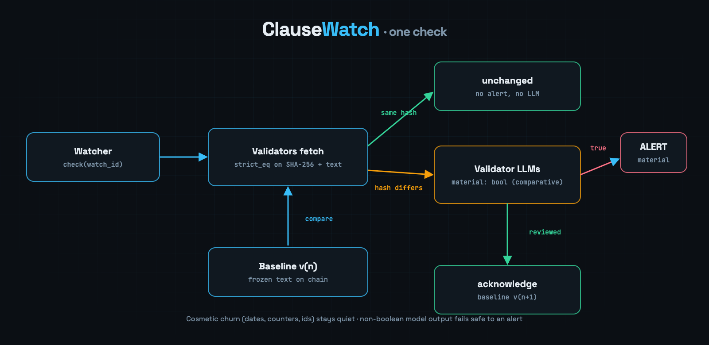

# ClauseWatch

<p align="center">
  
</p>

<p align="center">
  <strong>Terms, pricing and policy monitoring on GenLayer. Validators freeze the page, and when it changes their LLMs agree on one thing: does this change actually matter?</strong>
</p>

<p align="center">
  <a href="https://valentinzubok.github.io/ClauseWatch/"></a>
  <a href="https://github.com/valentinzubok/ClauseWatch/actions/workflows/ci.yml"></a>
  
  <a href="LICENSE"></a>
</p>

---

## The problem

Vendors change prices, SLAs and privacy terms quietly. Two naive ways to watch a page both fail:

- **Hash the page.** Every timestamp, counter or cache-buster changes the hash, so you drown in false alerts.
- **Ask an LLM every time.** One model, one opinion, no reproducibility, and nothing you can point at later.

## What ClauseWatch does

```
register_watch(id, url, label, criteria)
    validators fetch the page and agree on its SHA-256 and normalized text
    (eq_principle.strict_eq) → that text is baseline v1, frozen on chain

check(id)
    validators fetch it again under strict_eq
      ├─ same hash      → "unchanged". Deterministic, no LLM, no alert.
      └─ hash differs   → validators' LLMs compare BASELINE vs CURRENT against the
                          watch criteria and agree on ONE boolean via prompt_comparative:
                          material = true  → alert (price, SLA, liability, data scope…)
                          material = false → cosmetic churn, recorded but quiet

acknowledge(id)
    the watch creator accepts the current text as baseline v(n+1), so the next
    check compares against the version a human actually reviewed
```

<p align="center">
  
</p>

**Why only one boolean?** Free-form summaries never reach consensus across models. Grades, categories and
prose are derived locally; the value that validators must agree on is `material`, exactly as
`prompt_comparative` is designed for. If a model returns anything that is not a literal boolean, ClauseWatch
fails **safe**: it raises the alert. A false alert costs a glance, a missed clause costs money.

## Contract API

| Function | Who | What it does |
|---|---|---|
| `register_watch(watch_id, url, label, criteria)` | anyone | Freezes the page as baseline v1. Empty `criteria` uses the contract default. |
| `check(watch_id)` | anyone | Re-fetches under consensus; unchanged, or raises an alert with `material` true/false. |
| `acknowledge(watch_id)` | watch creator or owner | Promotes the pending version to baseline v(n+1). |
| `set_status(watch_id, "active"/"paused")` | watch creator or owner | Pauses or resumes checking. |
| `transfer_ownership(new_owner)` | owner | Moves contract ownership. |
| `get_watch` · `get_baseline_text` · `list_ids` · `list_alerts` · `get_alert` · `get_stats` · `get_owner` · `get_criteria_template` | view | Read state; `get_watch` returns previews, `get_baseline_text` the full frozen text. |

State per watch: `baseline_hash`, `baseline_text` (bounded to 6000 chars), `baseline_version`, the
`pending_*` snapshot awaiting acknowledgement, plus `checks`, `changes` and `material_changes` counters.
Alerts keep both hashes, the baseline version they were raised against, the verdict and a preview; the log
is trimmed to the newest 200.

## Live deployment

| | |
|---|---|
| **Console** | https://valentinzubok.github.io/ClauseWatch/ |
| **Contract** | see [`STUDIO_DEV_DEPLOY.md`](STUDIO_DEV_DEPLOY.md) — Studio Dev (chain 61997), source-verified |
| **Demo page** | [`web/public/fixtures/terms.html`](web/public/fixtures/terms.html) → https://valentinzubok.github.io/ClauseWatch/fixtures/terms.html |

The demo page is part of this repository, so the change ClauseWatch reacts to is a real commit you can read
in the git history, not a screenshot.

## Console

`web/` is a Next.js + `genlayer-js` console:

- Reads every watch, alert and counter straight from the contract, no wallet needed.
- Writes through MetaMask: register, check, acknowledge, pause/resume. It switches the wallet to chain 61997,
  attaches the Studio Dev fee deposit, waits for `ACCEPTED`, reloads from chain and links the transaction.
- **Get test GEN** button for fees.

```bash
cd web
npm install
npm run dev     # http://localhost:3013
```

`NEXT_PUBLIC_CLAUSEWATCH_ADDRESS` overrides the contract address.

## Contract tests

```bash
python3 -m pip install -r requirements-dev.txt
python3 -m pytest -q          # 10 tests
```

The suite fakes the GenVM module, so the consensus paths are exercised directly: baseline freezing, an
unchanged check, a cosmetic change, a material change with acknowledgement, non-boolean verdicts failing
safe, access control, alert trimming and text bounding.

## Related work

[DealGuard](https://github.com/valentinzubok/DealGuard) · [MetaEvidence](https://github.com/valentinzubok/MetaEvidence) ·
[DualSource](https://github.com/valentinzubok/DualSource) · [AgentBounty](https://github.com/valentinzubok/AgentBounty) ·
[PromptRegistry](https://github.com/valentinzubok/PromptRegistry)

## License

[MIT](LICENSE) © 2026 Valentyn Zubok
